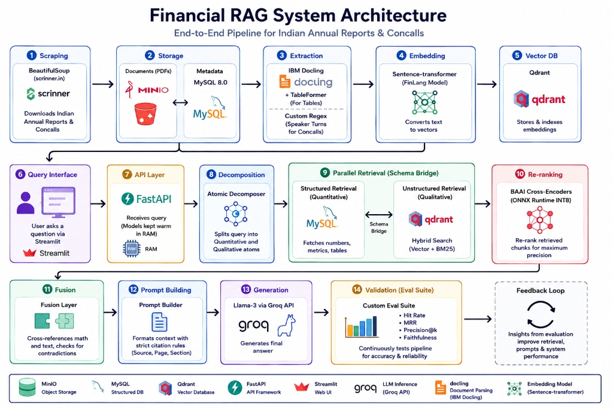

# Financial RAG

An end-to-end, highly structured Retrieval-Augmented Generation (RAG) system built specifically for Indian Equity Research (BSE/NSE). It processes Annual Reports and Earnings Concalls to answer complex financial queries with strictly cited math and qualitative context.

## Stack & Architecture

| Component | Tool / Technology |
|---|---|
| **Data Scraping** | BeautifulSoup (screener.in) |
| **Object Storage** | MinIO |
| **Structured DB** | MySQL 8.0 |
| **Extraction (PDFs)** | IBM Docling (TableFormer) + Custom Regex |
| **Embeddings** | sentence-transformers (FinLang Model) |
| **Vector DB** | Qdrant |
| **API Backend** | FastAPI |
| **Re-ranker** | BAAI Cross-Encoders (ONNX Runtime INT8) |
| **LLM Generation** | Llama-3 70B (via Groq API) / OpenRouter |
| **Web UI** | Streamlit |
| **Evaluation** | Custom Eval Suite (Hit Rate, MRR, Precision, Faithfulness) |

### System Architecture


### Core Pipeline (14 Steps)
1. **Scraping**: Automatically downloads Annual Reports & Concalls.
2. **Storage**: PDFs are saved in MinIO; metadata logs in MySQL 8.0.
3. **Extraction**: IBM Docling extracts layout-aware tables; Custom Regex slices Concalls into exact Speaker Turns.
4. **Embedding**: FinLang models convert chunks to semantic vectors.
5. **Vector DB**: Qdrant stores and indexes text.
6. **Query Interface**: Streamlit provides a clean chat UI.
7. **API Layer**: FastAPI keeps large models pre-loaded in RAM for millisecond latency.
8. **Decomposition**: Splitting questions into Quantitative (Math) and Qualitative (Text) needs.
9. **Parallel Retrieval (Schema Bridge)**: Fetches hard numbers from MySQL and qualitative chunks from Qdrant simultaneously.
10. **Re-ranking**: Cross-encoders guarantee absolute precision of retrieved chunks.
11. **Fusion**: Cross-references textual management claims against hard SQL numbers to detect contradictions (⚠) or confirmations (✓).
12. **Prompt Building**: Formats data into a strict citation-heavy structure.
13. **Generation**: Llama-3 answers based purely on retrieved context without hallucinating math.
14. **Validation**: Offline automated testing ensures precision and reliability.

## Directory Structure
```text
Financial-Rag/
├── config/              # Centralized settings
├── db/                  # MySQL schema and helpers
├── decomposer/          # Intent parser & Atomic Decomposer
├── eval/                # Custom eval suite (Hit Rate, MRR)
├── fusion/              # SQL/Text cross-referencing logic
├── pipeline/
│   ├── extract/         # Docling PDF extraction
│   ├── loader/          # Chunker and Qdrant integration
│   └── retrieval/       # Hybrid search and Re-ranker
├── rag/                 # LLM connection (Groq, Gemini)
├── schema_bridge/       # SQL + Vector parallel fetching
├── synthesis/           # Prompt formatting rules
├── utils/               # Loggers
├── screener_downloader.py # Scraper tool
├── Ingest.py            # Master ingestion script
├── server.py            # FastAPI backend
├── app.py               # Streamlit frontend
└── query_client.py      # CLI tool
```

## Setup & Execution

```bash
# 1. Install dependencies
pip install -r requirements.txt

# 2. Add API keys
export GROQ_API_KEY="gsk_xxxxxxxxxxxx"

# 3. Download & Ingest Company Data
python screener_downloader.py RELIANCE
python Ingest.py --symbol RELIANCE

# 4. Start the Backend API (FastAPI)
python server.py

# 5. Launch the UI (Streamlit)
streamlit run app.py
```